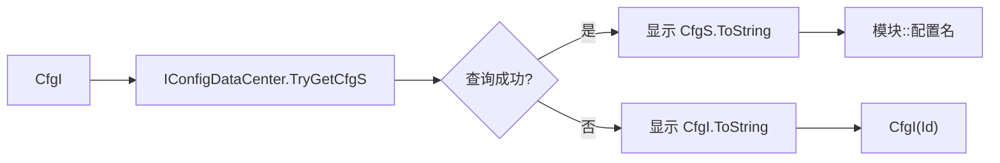
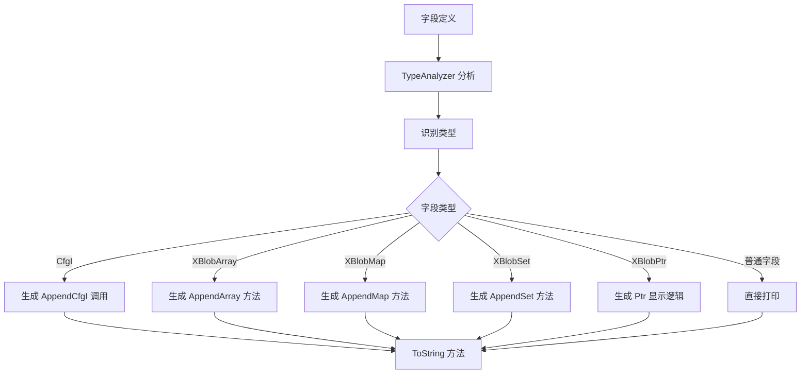

# ToString 生成功能实施总结

## 实施完成时间
2026-02-03

## 概述

成功为配置生成器的 `XXConfigUnmanaged` 结构体实现了增强的 ToString 方法生成功能，支持打印 CfgI（转为 CfgS）、容器内容和指针信息，并添加了条件编译保护。

## 实施的功能

### 1. CfgI 转 CfgS 显示

- **功能**：将 `CfgI<T>` 类型的配置 ID 转换为人类可读的配置名（格式：`模块::配置名`）
- **实现**：通过 `IConfigDataCenter.TryGetCfgS()` 方法反查配置名
- **示例输出**：`Id=MyMod::TestConfig1` 而不是 `Id=CfgI(1)`

### 2. 容器内容打印

支持三种容器类型的内容打印：

#### XBlobArray
- 最多打印 10 个元素
- 格式：`FieldName=[elem1, elem2, elem3, ...]`
- 超出部分显示：`...(N more)`

#### XBlobMap
- 最多打印 5 个键值对
- 格式：`FieldName={key1:value1, key2:value2, ...}`
- 超出部分显示：`...(N more)`

#### XBlobSet
- 最多打印 10 个元素
- 格式：`FieldName={elem1, elem2, elem3, ...}`
- 超出部分显示：`...(N more)`

### 3. XBlobPtr 指针信息

- **关联 CfgI 的指针**：显示为 `FieldName_Ref=Ptr->CfgS`
- **独立指针**：显示为 `FieldName=Ptr(offset)`

### 4. 双重载 ToString 方法

- **无参数版本**：`ToString()` - 容器显示为类型和 `[?]`
- **带容器版本**：`ToString(XBlobContainer container)` - 打印完整容器内容

### 5. 条件编译

所有 ToString 相关代码仅在 `DEBUG || UNITY_EDITOR` 下编译，不影响发布版本性能。

## 修改的文件

### 1. DTO 定义
**文件**: `Assets/XMFrame/Editor/Toolkit/Config/ConfigCodeGenDto.cs`

新增字段：
```csharp
public bool IsContainer { get; set; }
public string ContainerKind { get; set; }  // "Array", "Map", "Set"
public string ElementType { get; set; }
public string KeyType { get; set; }
public string ValueType { get; set; }
public bool ElementTypeIsCfgI { get; set; }
public bool KeyTypeIsCfgI { get; set; }
public bool ValueTypeIsCfgI { get; set; }
```

### 2. 类型分析器
**文件**: `Assets/XMFrame/Editor/UnityToolkit/TypeAnalyzer.cs`

新增方法：
- `IsXBlobArrayType()` - 识别 XBlobArray 并提取元素类型
- `IsXBlobMapType()` - 识别 XBlobMap 并提取键值类型
- `IsXBlobSetType()` - 识别 XBlobSet 并提取元素类型
- `IsCfgITypeString()` - 判断类型字符串是否是 CfgI

### 3. DTO 构建器
**文件**: `Assets/XMFrame/Editor/UnityToolkit/UnmanagedCodeGenerator.cs`

在 `ToUnmanagedDto()` 方法中：
- 添加容器类型识别逻辑
- 填充容器元数据到 DTO
- 检测元素/键/值类型是否为 CfgI

### 4. 模板数据构建器
**文件**: `Assets/XMFrame/Editor/Toolkit/Config/UnmanagedModelBuilder.cs`

在 `Build()` 方法中：
- 将容器元数据传递给 Scriban 模板
- 添加 8 个新的字段到 ScriptObject

### 5. 配置数据中心接口
**文件**: `Assets/XMFrame/Interfaces/ConfigMananger/IConfigDataCenter.cs`

新增方法：
```csharp
bool TryGetCfgS(CfgI cfgI, out CfgS cfgS);
```

### 6. 配置数据中心实现
**文件**: `Assets/XMFrame/Implementation/XConfigManager/ConfigDataCenter.cs`

实现方法：
```csharp
public bool TryGetCfgS(CfgI cfgI, out CfgS cfgS)
{
    return _cfgLookUp.TryGetKeyByValue(cfgI, out cfgS);
}
```

### 7. Scriban 模板
**文件**: `Assets/XMFrame/Editor/ConfigEditor/Templates/UnmanagedStruct.sbncs`

添加：
- ToString 方法生成逻辑（约 170 行）
- 条件编译指令 `#if DEBUG || UNITY_EDITOR`
- 容器打印辅助方法
- CfgI 转 CfgS 辅助方法

### 8. 嵌入式模板
**文件**: `Assets/XMFrame/Editor/UnityToolkit/EmbeddedTemplates.cs`

同步更新 `UnmanagedStructSbncs` 常量字符串。

## 技术细节

### 容器类型识别算法

```csharp
// 识别 XBlobArray<T>
if (unmanagedType.StartsWith("XBlobArray<") && unmanagedType.EndsWith(">"))
{
    elementType = unmanagedType.Substring(11, unmanagedType.Length - 12);
}

// 识别 XBlobMap<K, V>
// 使用 SplitGenericArguments() 处理嵌套泛型

// 识别 XBlobSet<T>
if (unmanagedType.StartsWith("XBlobSet<") && unmanagedType.EndsWith(">"))
{
    elementType = unmanagedType.Substring(9, unmanagedType.Length - 10);
}
```

### CfgI 转 CfgS 流程



### ToString 生成流程



## 生成的代码示例

### ToString 方法结构

```csharp
#if DEBUG || UNITY_EDITOR
public partial struct TestConfigUnManaged
{
    public override string ToString()
    {
        return ToStringInternal(null);
    }

    public string ToString(global::XBlobContainer container)
    {
        return ToStringInternal(container);
    }

    private string ToStringInternal(global::XBlobContainer? container)
    {
        var sb = new global::System.Text.StringBuilder();
        sb.Append("TestConfigUnManaged {");
        
        // CfgI 字段
        sb.Append("Id=");
        AppendCfgI(sb, Id);
        
        // XBlobPtr 关联字段
        sb.Append(", Id_Ref=Ptr->");
        AppendCfgI(sb, Id);
        
        // 普通字段
        sb.Append(", TestInt=" + TestInt);
        
        // 容器字段
        sb.Append(", TestSample=");
        if (container.HasValue)
            AppendArray_TestSample(sb, container.Value, TestSample);
        else
            sb.Append("XBlobArray<Int32>[?]");
        
        sb.Append(" }");
        return sb.ToString();
    }

    // 辅助方法...
}
#endif
```

## 性能考虑

1. **条件编译**：ToString 代码仅在 DEBUG/UNITY_EDITOR 下编译
2. **元素限制**：
   - Array/Set：最多 10 个元素
   - Map：最多 5 个键值对
3. **延迟查询**：CfgS 查询仅在 ToString 调用时执行
4. **零分配优化**：使用 StringBuilder 避免字符串拼接

## 后续使用说明

### 在 Unity Editor 中重新生成代码

```csharp
// 方法 1：通过菜单
// Tools > XMFrame > Generate Unmanaged Code

// 方法 2：通过代码
UnityToolkit.UnmanagedCodeGenerator.GenerateAllUnmanagedCode();
```

### 使用示例

```csharp
// 无容器参数
var config = new TestConfigUnManaged { Id = cfgi, TestInt = 42 };
Debug.Log(config.ToString());
// 输出：TestConfigUnManaged {Id=MyMod::TestConfig1, TestInt=42, TestSample=[?], ...}

// 带容器参数
Debug.Log(config.ToString(container));
// 输出：TestConfigUnManaged {Id=MyMod::TestConfig1, TestInt=42, TestSample=[1, 2, 3], ...}
```

## 测试验证

详细验证步骤请参考：`TOSTRING_GENERATION_VERIFICATION.md`

## 已知限制

1. **嵌套泛型**：极深的嵌套泛型（如 `XBlobMap<K, XBlobMap<K2, XBlobMap<K3, V>>>`）可能解析不完美
2. **自定义类型**：对于自定义结构体，只会调用其默认 ToString 方法
3. **容器元素限制**：大型容器不会打印全部内容，超出部分显示为 `...(N more)`

## 总结

本次实施完整地为配置生成器添加了 ToString 功能，包括：

✅ CfgI 转 CfgS 显示  
✅ 容器内容打印  
✅ 指针信息显示  
✅ 条件编译保护  
✅ 双重载方法（带/不带容器参数）  
✅ 完整的类型识别和元数据传递  
✅ 零 linter 错误  
✅ 详细的验证指南  

所有修改都遵循现有代码风格，并充分利用了现有的基础设施（如 BidirectionalDictionary、Scriban 模板系统等）。
